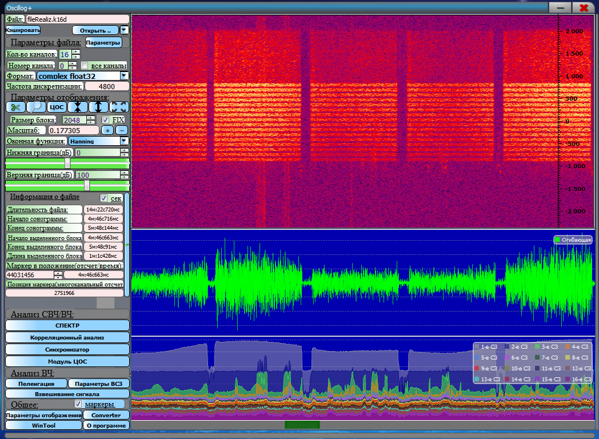

**Oscillog+**

## Данная версия программы архивная, новая версия NewOscillog (https://github.com/KORuL/NewOscillog)

{width="6.2659722222222225in"
height="6.591666666666667in"}

Это инструмент анализа сигналов, ПОсобный работать с различными типами
данных и осуществлять технический анализ различных видов:

• Спектральный анализ

• Спектрально-временной анализ

• Корреляционный анализ

• Пеленгационный анализ

• Собственно-структурный анализ

• Анализ оконных функций

• Анализ огибающей сигнала

• Модуль ЦОС -- реализованы различные инструменты для цифровой обработки
сигналов

• Взвешивание многоканальных реализаций по различным критериям
адаптивных антенных систем

• Конвертор

Oscillog+ работает со следующими форматами данных:

-   действительные и комплексные int16 сигналы, в формате \*.wav/\*.pcm/
    и т.д. (моно/стерео int16 (short) )

-   действительные и комплексные сигналы float32. (моно/стерео float32)

Реализации могут быть как одноканальные, так и многоканальные. Для
многоканальных реализаций реализовано взвешивания по критериям МСКО,
МВСМ и АРФ.

ПО позволяет выявлять принадлежность неизвестного сигнала к кадровой
структуре и определять синхровставки на первоначальном этапе.

ПО позволяет конвертировать комплексные (стерео) сигналы в
действительные (моно) и наоборот. А также из int16 во float32 и обратно.

Модуль ЦОС производит обработку по сценарию, в качестве модулей в нем
выступают dll, список dll можно пополнять, при необходимости можно
связаться с автором для получения инструкции к написанию и образца.

Для запуска приложения необходимо запустить «Oscillog+.exe». Если запуск
не произошел, необходимо установить vcredist_x86.exe или
vcredist_x64.exe

По любым вопросам или с пожеланиями/предложениями обращаться на почту
korul1@yandex.ru, в теме обязательно указать \"Oscillog+\", иначе письма
будут проигнорированы.

